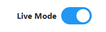

# Angular Slider
A slider made with Angular (6, 7).



## Getting Started

These instructions will get you a copy of the project up and running on your local machine for development and deployment purposes.
Please note that this is not a module. The repository itself is a source code.

### Prerequisites
- This component depends on @angular/core.

```
import { Component, OnInit, Input, EventEmitter, Output } from '@angular/core';
```

### Installing

* Simply download and copy the component to your Angular project.

## Usage
### Import the component

- Import to the module. For example, I copy the component to components.module and export it.

```
@NgModule({
  imports: [
    CommonModule
  ],
  exports: [SliderComponent],
  declarations: [SliderComponent]
})
```

- Use the component in app.module

```
@NgModule({
  declarations: [AppComponent],
  imports: [
    BrowserModule,
    ComponentsModule,
    HttpClientModule,
    RouterModule
  ],
  providers: [],
  bootstrap: [AppComponent]
})
```
### Use the slider in another component
- As usual

```
<app-slider [config]="sliderConfig" (callBack)="onToggled()"></app-slider>
```

- The component takes one binding property (callBack), where you can pass a callback function when user toggles the slider.
- The other property `[config]` is used to configure the slider label and state (checked, unchecked).

### Config the component
- Define the configuration class (interface):

```
export class SliderConfig {
  label: string;
  isChecked: boolean;
}
```

- Just pass the config to the `[config]` property.

### Customize the look

- Simply change the CSS.

## Built With

* [Angular](https://angular.io/) - The Angular framework used

## Contributing

* **Galvin Nguyen** - *Initial work* - [silencieuxle](https://github.com/silencieuxle)

## Authors

* **Galvin Nguyen** - *Initial work* - [silencieuxle](https://github.com/silencieuxle)

## License

This project is licensed under the GNU General Public License.
